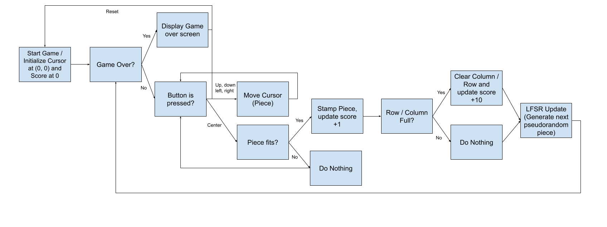

# CPE 487 Final Project - Block Blast
By: Aleena Kelkar, Aruna Pillai, William Getts

A 2D grid where lining up blocks and clearing grids gains you points.

## Project Overview

### Gameplay Video on Monitor
https://youtube.com/shorts/lHxr1ozWsiM?feature=share

### Main Aspects of Block Blast

### Empty Grid
Game loads with an empty teal box.

### Block Placement and Spawning
Place a block using the buttons. Block moves left with the btnl button, right with btnr button, up with btnu button, and down with btnd button, and is then stamped in place with btnc button. New Block spawns where the cursor remains after placing old block.

### Column and Row Clearing
If  row or column is cleared, that row/column is cleared and turns empty.

### Score Calculation
| Player Movement|Score Calculation | Final Score |
|----------|----------|----------|
| Places a piece, nothing clears  | + 1 | 1 |
| Places a piece, a row clears | +1+10  | +11 |
| Places a piece, a column clears | +1+10  | +11 |
| Places a piece, a row and column clears | +1+10+10  | +21 |

## Expected Behavior
The game loads with an empty teal box. The first piece spawns (a red single square), and the block moves left with the btnl button, right with the btnr button, up with btnu button, and down with btnd button. The block is then placed and stamped using the btnc button. The new piece spawns exactly where the old piece was and has a new color that overlaps with the original stamped piece and moves with the same button controls. When either a row or column is fully populated, it clears and turns to all black, and the score on the board updates accordingly. The game is over when the new spawned piece cannot fit in the current grid. Grid is reset using CPU_RESET button.

### Block Diagram of Game Functionality

  
  
## Required Hardware

For the game to work, you will need the following:
- Nexys A7-100T FPGA Board
  
  
  
- Micro USB cable
  
  
  
- VGA Cable
  
  
  
- Monitor with VGA Port
  
  
  
- AMD Vivado™ Design Suite


## Setup
Download the following files from the repository to your computer: clk_wiz_0.vhd, clk_wiz_0_clk_wiz.vhd, leddec.vhd, leddec16.vhd, vga_sync. vhd, block_blast_game.vhd, block_blast_top.vhd.

Once you have downloaded the files, follow these steps:
1. Open **AMD Vivado™ Design Suite** and create a new RTL project called block_blast_game_final in Vivado Quick Start
2. In the "Add Sources" section, click on "Add Files" and add all of the `.vhd` files from this repository
3. In the "Add Constraints" section, click on "Add Files" and add the `.xdc` file from this repository
4. In the "Default Part" section, click on "Boards" and find and choose the Neyxs A7-100T board
5. Click "Finish" in the New Project Summary page
6. Run Synthesis
7. Run Implementation
8. Generate Bitstream
9. Connect the Nexys A7-100T board to the computer using the Micro USB cable and switch the power ON
10. Connect the VGA cable from the Nexys A7-100T board to the VGA monitor
11. Open Hardware Manager
     - "Open Target"
     - "Auto Connect"
     - "Program Device"
12. Program should appear on the screen

## Module Hierarchy
   
  
## Inputs and Outputs

### `Block_Blast_Game.vhd`
```
entity block_blast_game is
  port (
    clk        : in  std_logic;
    rst        : in  std_logic;
    btn_left   : in  std_logic;
    btn_right  : in  std_logic;
    btn_up     : in  std_logic;
    btn_down   : in  std_logic;
    btn_place  : in  std_logic;
    pixel_row  : in  std_logic_vector(10 downto 0);
    pixel_col  : in  std_logic_vector(10 downto 0);
    score_out  : out std_logic_vector(15 downto 0);
    red_out    : out std_logic_vector(1 downto 0);
    green_out  : out std_logic;
    blue_out   : out std_logic
  );
end block_blast_game;
```

### Inputs
- clk: System clock
- rst: Mainly used for testing, to reset the whole grid
- btn_left: Button input for making block go left.
-  btn_right: Button input for making block go right.
- btn_up: Button input for making block go up.
- btn_down: Button input for making block go down.
- btn_place: button input for stamping block on the grid.
- pixel_row: current cursor position (x-dir)
- pixel_col: current cursor position (y-dir)

### Outputs
- score_out: score calculator to be displayed on board
- red_out: red component of color of stamped block (two bit vector because wanted more color options, derived from lab 3)
- green_out: red component of color of stamped block
- blue_out: red component of color of stamped block

### `Block_Blast_Top.vhd`
```
entity block_blast_top is
  port (
    CLK100MHZ  : in  std_logic;
    CPU_RESETN : in  std_logic;                
    BTNL       : in  std_logic;
    BTNR       : in  std_logic;
    BTNU       : in  std_logic;
    BTND       : in  std_logic;
    BTNC       : in  std_logic;
    VGA_R      : out std_logic_vector(3 downto 0);
    VGA_G      : out std_logic_vector(3 downto 0);
    VGA_B      : out std_logic_vector(3 downto 0);
    VGA_HS     : out std_logic;
    VGA_VS     : out std_logic;
    SEG        : out std_logic_vector(6 downto 0);
    DP         : out std_logic;
    AN         : out std_logic_vector(7 downto 0)
  );
end block_blast_top;
```

### Inputs
- CLK100MHZ: System Clock
- CPU_RESETN : CPU Reset button
- BTNL       : Left Button
- BTNR       : Right Button
- BTNU       : Up Button
- BTND       : Down Button
- BTNC       : Stamp Button
- 
### Outputs
- VGA_R      : Red color component of the output color of each piece
- VGA_G      : Green color component of output color of each piece
- VGA_B      : Blue color component of output color of each pice
- VGA_HS     : Counts each horizontal line on the monitor 
- VGA_VS     : Counts each vertical line on the monitor
- SEG        : Segment on leddec
- DP         : Decimals for each score
- AN         : Anode on leddec
- 
## Modifications

### Set of Preset Blocks taken from Tetris Fall 2023
We wanted to create a random block generator, where the options are from 7 preset blocks. This was done by an array, similiar to the old Tetris project where they select a block option from an array. Each index marks where the block will extend to, essentially adding a new square there. The same logic applies for colors, as there are preset colors and the random generator should just select from this constant color type.

### `Block_Blast_Game.vhd`
```
  constant SHAPES : all_shapes_t := (
    (('1','0','0'),('0','0','0'),('0','0','0')),  -- 0: 1x1
    (('1','1','0'),('0','0','0'),('0','0','0')),  -- 1: 1x2H
    (('1','1','1'),('0','0','0'),('0','0','0')),  -- 2: 1x3H
    (('1','0','0'),('1','0','0'),('0','0','0')),  -- 3: 2x1V
    (('1','0','0'),('1','0','0'),('1','0','0')),  -- 4: 3x1V
    (('1','1','0'),('1','1','0'),('0','0','0')),  -- 5: 2x2
    (('1','0','0'),('1','0','0'),('1','1','0')),  -- 6: L
    (('0','1','0'),('0','1','0'),('1','1','0'))   -- 7: J
  );
```
### `Block_Blast_Game.vhd`
```
constant PALETTE : palette_t := (
    0 => (r => "11", g => '0', b => '0'),  -- Red
    1 => (r => "00", g => '1', b => '0'),  -- Green
    2 => (r => "00", g => '0', b => '1'),  -- Blue
    3 => (r => "11", g => '1', b => '0'),  -- Yellow
    4 => (r => "11", g => '0', b => '1'),  -- Magenta
    5 => (r => "00", g => '1', b => '1'),  -- Cyan
    6 => (r => "10", g => '1', b => '0'),  -- Orange
    7 => (r => "11", g => '1', b => '1')   -- White
  );

```
### Slow Clock Tick Taken from Tetris
This process is from the Tetris game from Fall 2023. This process runs on every rising edge of the clock and increments a counter called clk_div. On each cycle, it resets slow_tick to 0 by default. When the counter reaches 0 (after wrapping around), it sets slow_tick to 1 for exactly one clock cycle. This effectively creates a periodic pulse that occurs once every full count of the counter.
### `Block_Blast_Game.vhd`
```
 process(clk)
  begin
    if rising_edge(clk) then
      clk_div  <= clk_div + 1;
      slow_tick <= '0';
      if clk_div = 0 then slow_tick <= '1'; end if;
    end if;
  end process;
end block_blast_top;
```

## Original Code 
### Leddec file Modified from Pong Lab
```
-- leddec.vhd
-- Score display driver for Block Blast
-- Wraps leddec16: generates the mux clock, converts binary score to
-- packed BCD (one decimal digit per nibble), and cycles dig 0-3.
--
-- Display layout (right-justified on digits 0-3):
--   digit 3 = thousands, digit 2 = hundreds,
--   digit 1 = tens,      digit 0 = ones
-- Digits 4-7 are left off (leddec16 drives anode="11111111" for dig>3).

library ieee;
use ieee.std_logic_1164.all;
use ieee.std_logic_unsigned.all;
use ieee.numeric_std.all;

entity leddec is
  port (
    clk   : in  std_logic;                      -- 40 MHz
    score : in  std_logic_vector(15 downto 0);  -- binary score from game
    seg   : out std_logic_vector(6 downto 0);
    anode : out std_logic_vector(7 downto 0)
  );
end leddec;

architecture Behavioral of leddec is

  signal div_cnt  : std_logic_vector(14 downto 0) := (others => '0');
  signal dig      : std_logic_vector(2 downto 0)  := "000";

  signal bcd_data : std_logic_vector(15 downto 0);

  component leddec16
    port (
      dig   : in  std_logic_vector(2 downto 0);
      data  : in  std_logic_vector(15 downto 0);
      anode : out std_logic_vector(7 downto 0);
      seg   : out std_logic_vector(6 downto 0)
    );
  end component;

  signal score_int : integer range 0 to 65535;
  signal s_cap     : integer range 0 to 9999;
  signal thou, hund, tens_d, ones_d : integer range 0 to 9;

begin

  score_int <= to_integer(unsigned(score));
  s_cap     <= 9999 when score_int > 9999 else score_int;

  thou   <= s_cap / 1000;
  hund   <= (s_cap mod 1000) / 100;
  tens_d <= (s_cap mod 100)  / 10;
  ones_d <=  s_cap mod 10;

  -- Pack 4 decimal digits into 16-bit word (each nibble = one digit)
  bcd_data <= std_logic_vector(to_unsigned(thou,   4)) &
              std_logic_vector(to_unsigned(hund,   4)) &
              std_logic_vector(to_unsigned(tens_d, 4)) &
              std_logic_vector(to_unsigned(ones_d, 4));

  process(clk)
  begin
    if rising_edge(clk) then
      div_cnt <= div_cnt + 1;
      if div_cnt = 0 then
        if dig = "011" then
          dig <= "000";
        else
          dig <= dig + 1;
        end if;
      end if;
    end if;
  end process;

  U_DEC : leddec16
    port map (
      dig   => dig,
      data  => bcd_data,
      anode => anode,
      seg   => seg
    );

end Behavioral;
```
### Important Behavior: Block Placement
```
            new_grid       := grid;
            new_color_grid := color_grid;
            for pr in 0 to 2 loop
              for pc in 0 to 2 loop
                if SHAPES(pt, pr, pc) = '1' then
                  new_grid(cursor_r + pr)(cursor_c + pc)       := '1';
                  new_color_grid(cursor_r + pr)(cursor_c + pc) := piece_type;
                end if;
              end loop;
            end loop;
```
### Important Behavior: Check if Piece Fits in Grid
```
           for tr in 0 to GRID_ROWS-1 loop
              for tc in 0 to GRID_COLS-1 loop
                if piece_fits(new_grid,
                              std_logic_vector(to_unsigned(next_type, 3)),
                              tr, tc) then
                  any_fit := true;
                end if;
              end loop;
            end loop;
            if not any_fit then game_over <= '1'; end if;
```
### Important Behavior: Game over logic
```
      if game_over = '1' then
        if cell_occupied = '1' then
          r_out := "11"; g_out := '0'; b_out := '0';
        else
          r_out := "01"; g_out := '0'; b_out := '0';
        end if;
```
### Important Behvaior: Row and Column Clearing
```
            -- Clear full rows
            lines := 0;
            for r in 0 to GRID_ROWS-1 loop
              row_full := '1';
              for c in 0 to GRID_COLS-1 loop
                if new_grid(r)(c) = '0' then row_full := '0'; end if;
              end loop;
              if row_full = '1' then
                lines := lines + 1;
                for c in 0 to GRID_COLS-1 loop
                  new_grid(r)(c)       := '0';
                  new_color_grid(r)(c) := "000";
                end loop;
              end if;
            end loop;

            -- Clear full columns
            for c in 0 to GRID_COLS-1 loop
              col_full := '1';
              for r in 0 to GRID_ROWS-1 loop
                if new_grid(r)(c) = '0' then col_full := '0'; end if;
              end loop;
              if col_full = '1' then
                lines := lines + 1;
                for r in 0 to GRID_ROWS-1 loop
                  new_grid(r)(c)       := '0';
                  new_color_grid(r)(c) := "000";
                end loop;
              end if;
            end loop;

            grid       <= new_grid;
            color_grid <= new_color_grid;

```
### Important Behavior: New Block Spawning
```
            next_lfsr  := lfsr(6 downto 0) & (lfsr(7) xor lfsr(5) xor lfsr(4) xor lfsr(3));
            lfsr       <= next_lfsr;
            next_type  := to_integer(unsigned(next_lfsr(2 downto 0)));
            piece_type <= std_logic_vector(to_unsigned(next_type, 3));

```
### Important Behavior: Coloring of Blocks based on Placement
```
    if in_grid then
      cell_c := (current_x_int - GRID_LEFT) / CELL_SIZE;
      cell_r := (current_y_int - GRID_TOP)  / CELL_SIZE;
      col_i  := (current_x_int - GRID_LEFT) mod CELL_SIZE;
      row_i  := (current_y_int - GRID_TOP)  mod CELL_SIZE;

      on_border := (row_i < 2) or (row_i >= CELL_SIZE-2) or
                   (col_i < 2) or (col_i >= CELL_SIZE-2);

      cell_occupied   := grid(cell_r)(cell_c);
      cell_color_s  := to_integer(unsigned(color_grid(cell_r)(cell_c)));
      piece_color_s := to_integer(unsigned(piece_type));

      on_piece := false;
      for pr in 0 to 2 loop
        for pc in 0 to 2 loop
          if SHAPES(piece_color_s, pr, pc) = '1' then
            if (cursor_r + pr) = cell_r and (cursor_c + pc) = cell_c then
              on_piece := true;
            end if;
          end if;
        end loop;
      end loop;

      if game_over = '1' then
        if cell_occupied = '1' then
          r_out := "11"; g_out := '0'; b_out := '0';
        else
          r_out := "01"; g_out := '0'; b_out := '0';
        end if;
        
      elsif on_border then
       
        
        r_out := "00"; g_out := '0'; b_out := '0';
        

       elsif on_piece then
     
        r_out := PALETTE(piece_color_s).r;
        g_out := PALETTE(piece_color_s).g;
        b_out := PALETTE(piece_color_s).b;
      
      elsif cell_occupied = '1' then
        -- Placed block: full color from palette
        r_out := PALETTE(cell_color_s).r;
        g_out := PALETTE(cell_color_s).g;
        b_out := PALETTE(cell_color_s).b;
      
     
      else
        r_out := "00"; g_out := '0'; b_out := '0';
      end if;

    else
      r_out := "00"; g_out := '0'; b_out := '0';
      if (current_x_int = GRID_LEFT-1 or current_x_int = GRID_RIGHT) then
        if current_y_int >= GRID_TOP-1 and current_y_int <= GRID_BOTTOM then
          r_out := "01"; g_out := '1'; b_out := '1';
        end if;
      end if;
      if (current_y_int = GRID_TOP-1 or current_y_int = GRID_BOTTOM) then
        if current_x_int >= GRID_LEFT-1 and current_x_int <= GRID_RIGHT then
          r_out := "01"; g_out := '1'; b_out := '1';
        end if;
      end if;
    end if;

```
## Conclusion

### Responsibilities

#### Aleena Kelkar:

#### Aruna Pillai:

#### William Getts:

### Timeline of Work Completed

### Difficulties 


