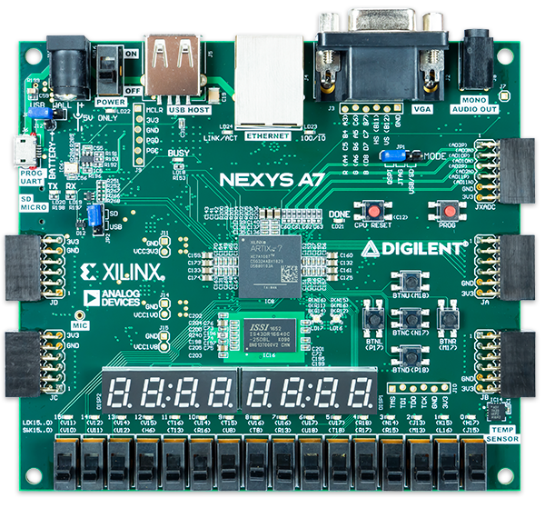
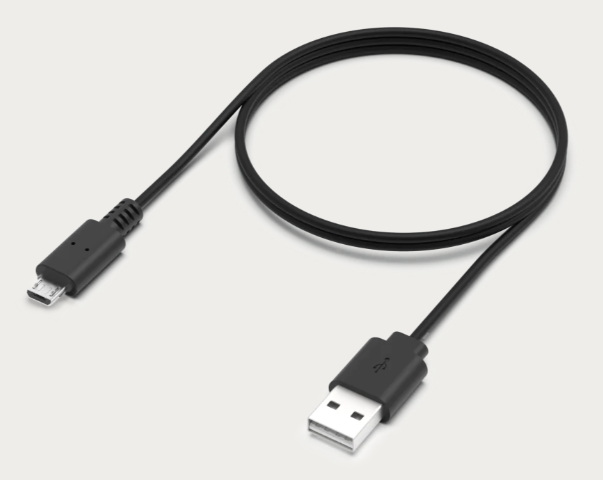
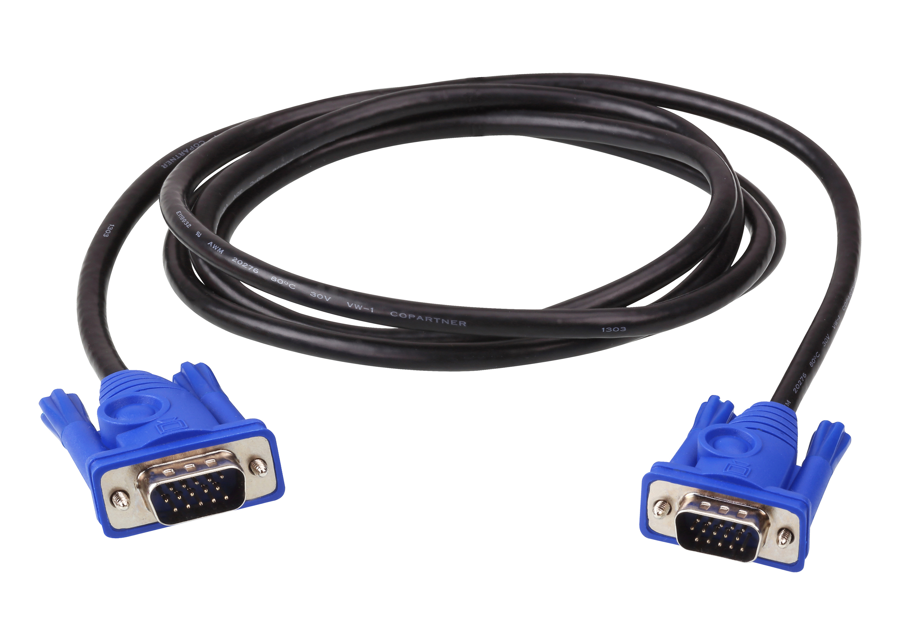
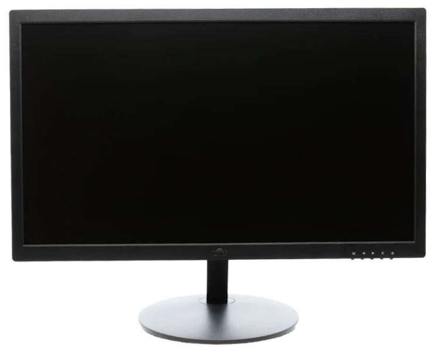

# CPE 487 Final Project - Block Blast
By: Aleena Kelkar, Aruna Pillai, William Getts

A 2D grid where lining up blocks and clearing grids gains you points.

## Project Overview

### Gameplay Video on Monitor

### Gameplay Score Counter

### Main Aspects of Block Blast

### Empty Grid
Game loads with an empty teal box.

### Block Placement and Spawning
Place a block using the buttons. Block moves left with the btnl button, right with btnr button, up with btnu button, and down with btnd button, and is then stamped in place with btnc button. New Block spawns where the cursor remains after placing old block.

### Column and Row Clearing
If  row or column is cleared, that row/column is cleared and turns empty.

### Score Calculation
| Player Movement|Score Calculation | Final Score |
|----------|----------|----------|
| Places a piece, nothing clears  | + 1 | 1 |
| Places a piece, a row clears | +1+10  | +11 |
| Places a piece, a column clears | +1+10  | +11 |
| Places a piece, a row and column clears | +1+10+10  | +21 |

## Expected Behavior
The game loads with an empty teal box. The first piece spawns (a red single square), and the block moves left with the btnl button, right with the btnr button, up with btnu button, and down with btnd button. The block is then placed and stamped using the btnc button. The new piece spawns exactly where the old piece was and has a new color that overlaps with the original stamped piece and moves with the same button controls. When either a row or column is fully populated, it clears and turns to all black, and the score on the board updates accordingly. The game is over when the new spawned piece cannot fit in the current grid. Grid is reset using CPU_RESET button.

### Block Diagram of Game Functionality

## Required Hardware

For the game to work, you will need the following:
- Nexys A7-100T FPGA Board
  
  
  
- Micro USB cable
  
  
  
- VGA Cable
  
  
  
- Monitor with VGA Port
  
  
  
- AMD Vivado™ Design Suite


## Setup
Download the following files from the repository to your computer: clk_

Once you have downloaded the files, follow these steps:
1. Open **AMD Vivado™ Design Suite** and create a new RTL project called block_blast_game_final in Vivado Quick Start
2. In the "Add Sources" section, click on "Add Files" and add all of the `.vhd` files from this repository
3. In the "Add Constraints" section, click on "Add Files" and add the `.xdc` file from this repository
4. In the "Default Part" section, click on "Boards" and find and choose the Neyxs A7-100T board
5. Click "Finish" in the New Project Summary page
6. Run Synthesis
7. Run Implementation
8. Generate Bitstream
9. Connect the Nexys A7-100T board to the computer using the Micro USB cable and switch the power ON
10. Connect the VGA cable from the Nexys A7-100T board to the VGA monitor
11. Open Hardware Manager
     - "Open Target"
     - "Auto Connect"
     - "Program Device"
12. Program should appear on the screen

## Module Hierarchy

## Inputs and Outputs

### `Block_Blast_Game.vhd`
```
entity block_blast_game is
  port (
    clk        : in  std_logic;
    rst        : in  std_logic;
    btn_left   : in  std_logic;
    btn_right  : in  std_logic;
    btn_up     : in  std_logic;
    btn_down   : in  std_logic;
    btn_place  : in  std_logic;
    pixel_row  : in  std_logic_vector(10 downto 0);
    pixel_col  : in  std_logic_vector(10 downto 0);
    score_out  : out std_logic_vector(15 downto 0);
    red_out    : out std_logic_vector(1 downto 0);
    green_out  : out std_logic;
    blue_out   : out std_logic
  );
end block_blast_game;
```

### Inputs
clk: System clock
rst: Mainly used for testing, to reset the whole grid
btn_left: Button input for making block go left.
btn_right: Button input for making block go right.
B
### Outputs

### `Block_Blast_Top.vhd`
```
entity block_blast_top is
  port (
    CLK100MHZ  : in  std_logic;
    CPU_RESETN : in  std_logic;                
    BTNL       : in  std_logic;
    BTNR       : in  std_logic;
    BTNU       : in  std_logic;
    BTND       : in  std_logic;
    BTNC       : in  std_logic;
    VGA_R      : out std_logic_vector(3 downto 0);
    VGA_G      : out std_logic_vector(3 downto 0);
    VGA_B      : out std_logic_vector(3 downto 0);
    VGA_HS     : out std_logic;
    VGA_VS     : out std_logic;
    SEG        : out std_logic_vector(6 downto 0);
    DP         : out std_logic;
    AN         : out std_logic_vector(7 downto 0)
  );
end block_blast_top;
```

### Inputs

### Outputs

## Modifications

### Set of Preset Blocks taken from Tetris Fall 2023

### Slow Clock Tick Taken from Tetris

### Leddec file Modified from Pong Lab

## Original Code 

### Important Behavior: Block Placement

### Important Behavior: Check if Piece Fits in Grid

### Important Behvaior: Row and Column Clearing

### Important Behavior: New Block Spawning

### Important Behavior: Coloring of Blocks based on Placement

## Conclusion

### Responsibilities

#### Aleena Kelkar:

#### Aruna Pillai:

#### William Getts:

### Timeline of Work Completed

### Difficulties 


